# Aspire Workshop

In this workshop we'll be working with the Ghost Tracking application. Below is the architecture of our project with some explanation of each service. During this exercise we will be adding Aspire to the project and making the application work.

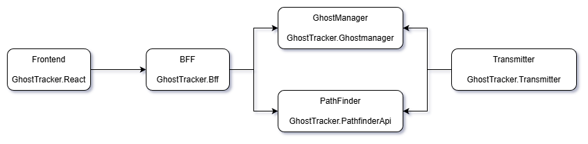

Frontend: This is a react frontend. The frontend will display a map with the location of each active ghost.
BFF: A Backend For Frontend web api that provides public endpoints for the frontend to retrieve information.
GhostManager: This web api maintains all information of ghosts.
PathFinder: This is the navigation application. For now this web application only stores the location of each ghost.
Transmitter: The transmitter is a IOT service that runs on each ghost. Each transmitter should transmit data about the ghost it's on to the GhostManager and PathFinder services.

## Step 1 - Project exploration

Navigate to the "Starter" folder, open the solution and look at the project structure. You should be able to spot all the services mentioned above. There will also be an additional project named "GhostTracker.AppHost". This is our Aspire Host file that we will be using to Aspire-ify our project.

The AppHost project contains only one "program.cs" file that is almost empty. 

```c#
var builder = DistributedApplication.CreateBuilder(args);

builder.Build().Run();
```

You'll notice a `DistributedApplication` builder in the AppHost program.cs file. This may seem familiar since it's similar to the ASP.NET program.cs.

Now run the solution by setting the AppHost project as the startup project of your solution or run `dotnet run` from the apphost folder.

Our aspire application will be started and a browser will open with an empty dashboard.

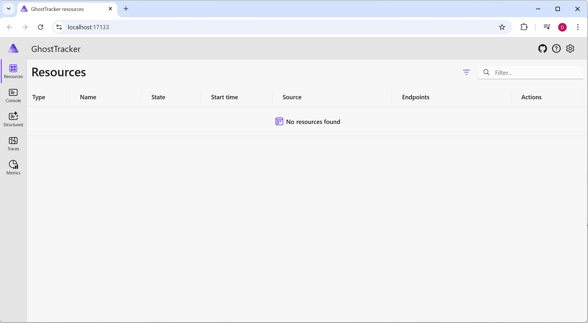

## Step 2 - Let's define our infrastructure

To run other projects in the solution, we need to define to our AppHost what to run and how to run it. Let's start by adding our BFF first.

We need to add the Bff project to our builder. This is very straightforward. Add the bff project as a project reference to the AppHost project.

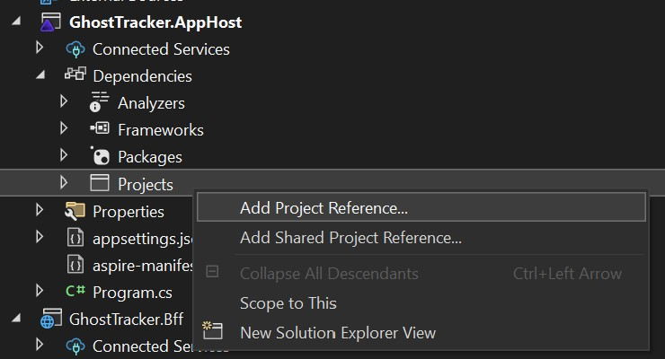

Next add the bff project to our Aspire builder with the following code:

```c#
builder.AddProject<Projects.GhostTracker_Bff>("bff");
```

Note that the static class `Projects.GhostTracker_Bff` is a class that was source generated by Aspire. A reference like this is created for each dependency added to the AppHost project. The name that we specify as parameter of the method is the name used in the dashboard for the service. It is advised to keep the name of all resources one word without spaces because it will have more uses for other features later on in the exercise.

If we run our project now, we will see that the Bff project appears in the dashboard and has a link to its swagger page.

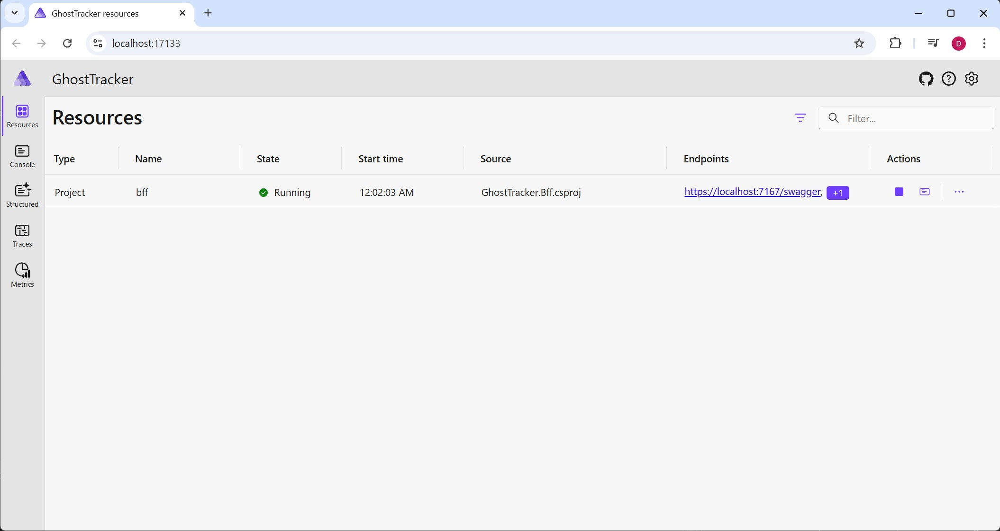

Now lets define our GhostsManager service and PathFinder service as well:

```c#
builder.AddProject<Projects.GhostTracker_GhostsManager>("ghostmanagerapi");
builder.AddProject<Projects.GhostTracker_PathFinderApi>("pathfinderapi");
```

To define our react we need to take another approach. The `AddProject` method can only be used for other C# projects in the same solution. Fear not, Aspire offers a wide array for integration with a lot of different thing. By adding the `Aspire.Hosting.NodeJs` nuget package (Already added!) we can integrate with any type of node application. Simply add the following code to the builder

```c#
builder.AddNpmApp("react", "../GhostTracker.React")
    .WithEnvironment("BROWSER", "none") // Disable opening browser on npm start
    .WithHttpEndpoint(env: "PORT"); // We will be forwarding a random port on which the frontend will run.
```

This code will start the react application by calling `npm start` in the specified folder when the AppHost is starting up.

If you run the application again your dashboard should contain the frontend, bff, ghosts manager and pathfinder services. Make sure to check that the frontend works and check the Console, Structured, Traces and Metrics tab at the left on the dashboard.

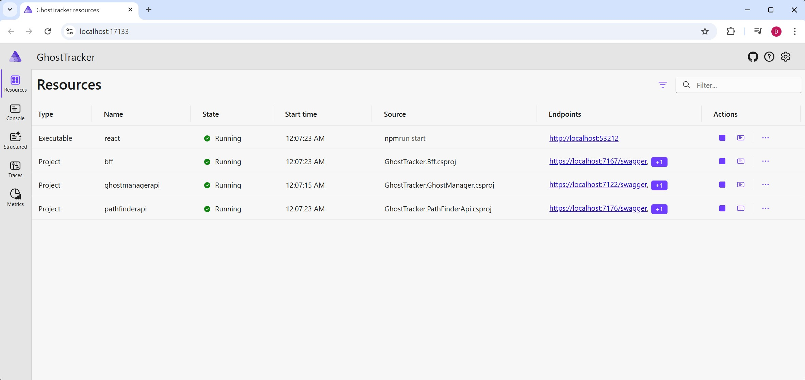

Once you're done exploring you should have noticed that the frontend is working and you are able to see the console output of each application you started. Unfortunately the structured logging and metrics don't seem to be working yet. We will be fixing this in the next step.

### Extra - Opinionated packages for you

Aspire is an opinionated framework defined by Microsoft. This is not only reflected in how Aspire works but is also related to Aspire specific nuget packages that are available. Each package with the owner "Aspire" is an Aspire package that is open source, propably created by the community and 100% curated by a panel of experts and architects from the Aspire team.

Explore the hosting options by opening the Nuget dependency manager and searching for `owner:Aspire` or select your AppHost project, right-click and go Add -> .NET Aspire Package...

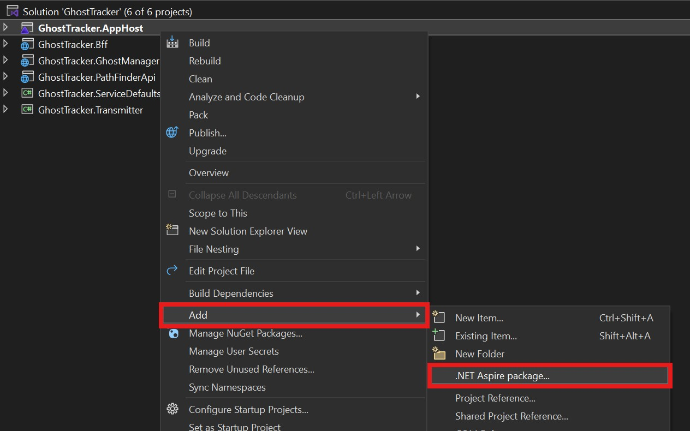

When adding dependencies like RabbitMQ of SQLServer Aspire is able to deploy these dependencies itself, either by spinning up a docker image or by connecting to a configured existing instance. This for both the local development as deployment on Azure or other cloud providers.

Aspire differentiates Aspire packages in two categories: hosting and integration packages. Hosting packages are meant to be added to your AppHost project. They contain the code to setup an integration when building the application. Hosting packages typically start with `Aspire.Hosting.{packageName}`. Integration packages are opinionated implementations of how to integrate with hosted services. These integrations are typically preconfigured to setup health endpoint checks and structured logging for your integrations.

## Step 3 - Setting service defaults

To add structured logging, we need to apply open telemetry standard logging to all our services. This can be a lot of work to do right. Luckily Aspire can take care of this for us. The Aspire team has even defined a very handy base template to get started with.

Right-click the solution and add a new project to our solution. In the project templates explorer search for the `aspire service defaults` template.

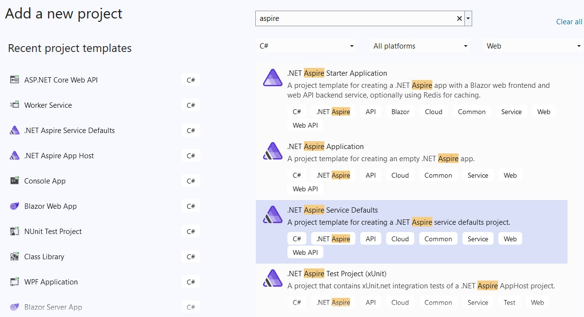

Select this template and give it the name `GhostTracker.ServiceDefaults`. It's important to make project name end with 'ServiceDefaults'. This will enable Visual Studio to add an extra option when adding any other project in the future named "Add Service Default". This will make sure the service defaults is already included in the new project AND the new project will automatically be added to the AppHost file because it recognizes that we are working in an Aspire project.

Now that we have service defaults you can have a look at the project. You'll notice that it only contains an Extensions.cs file that exposes two important public extension methods `AddServiceDefaults` and `MapDefaultEndpoints`.

The `AddServiceDefaults` method will add services like open telemetry, health checks, service discovery and standard resiliency to our projects. Those are already fully configured by the standards of the Aspire team.

The `MapDefaultEndpoints` adds some default health endpoints to our project for development.

The purpose of this project is to add default configuration that is needed in every project in the solution. Any configuration that you want to add that is needed by every project should be done in these methods.

To continue with the exercise, add these two methods to the program.cs file of the Bff, GhostsManager and Pathfinder projects.

```c#
// other code ommited
builder.AddServiceDefaults();
// ...
app.MapDefaultEndpoints();
```

Now when we start our project we will notice in our dashboard that open telemetry is integrated and we will be able to see traces, structured logs and metrics. Explore the dashboard a bit.

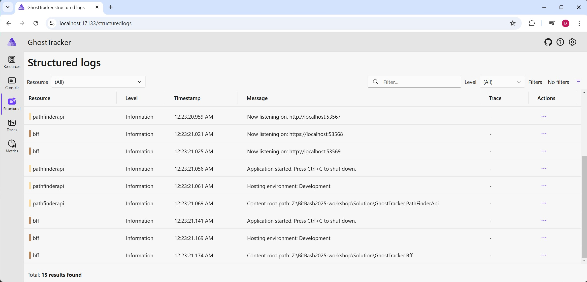
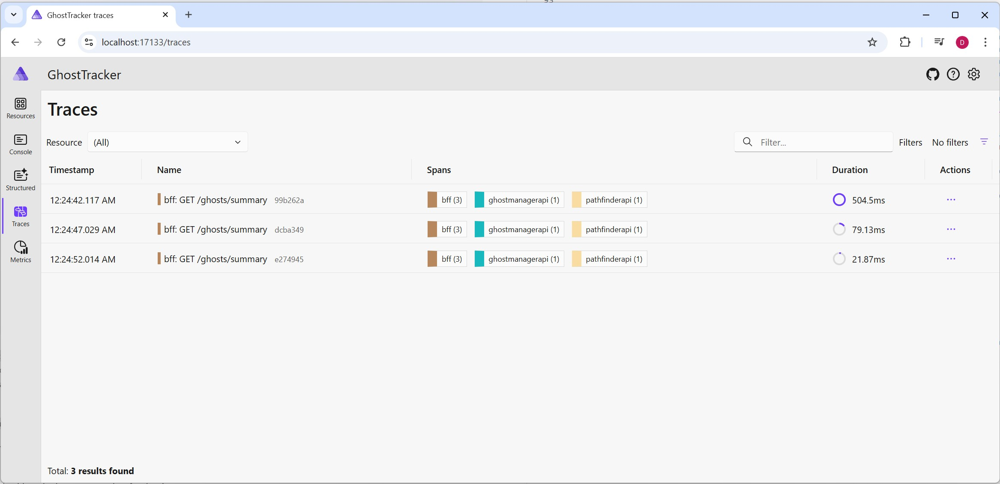

## Step 4 - Service discovery

In the service defaults a "ServiceDiscovery" module is added to your services. This is a very handy nuget package extension that helps with making calls to other services. Currently when the BFF talks to the manager and pathfinder services, it does so with a hard-coded url and port. This is not ideal.

```c#
// Currently in GhostTracker.Bff program.cs
builder.Services.AddHttpClient<GhostManagerApi>(static client => client.BaseAddress = new("https://localhost:7122"));
builder.Services.AddHttpClient<PathFinderApiClient>(static client => client.BaseAddress = new("https://localhost:7176"));
```

With Service Discovery we can make this a lot easier. To start we need to tell Aspire and Service Discovery that the Bff needs a reference to the manager and pathfinder service. This can be configured in the AppHost as follows:

```c#
var ghostManagerApi = builder.AddProject<Projects.GhostTracker_GhostsManager>("ghostmanagerapi");
var pathfinderApi = builder.AddProject<Projects.GhostTracker_PathFinderApi>("pathfinderapi");

var bff = builder.AddProject<Projects.GhostTracker_Bff>("bff")
    .WithReference(ghostManagerApi)
    .WithReference(pathfinderApi);
```

We simply tell the builder there is a reference to some other projects that are already added. What this will do in the code behind is add environment variable to the BFF service. You can see this by viewing the details of the bff service in the dashboard.

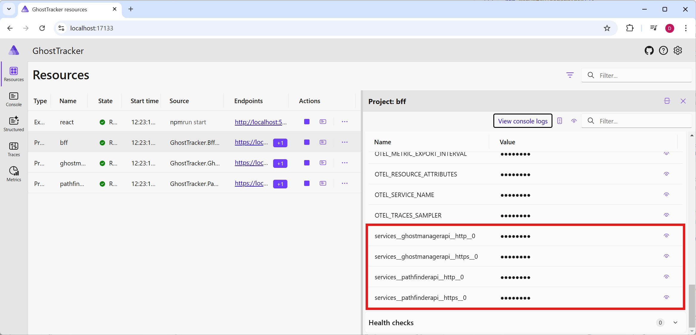

Notice that the name we gave to each project in our AppHost project is used as part of the environment variable name.

Now we just need to let our Discovery Service package know where to use these values. We can do this by simply changing the urls we use to register our HttpClient with the name of our services as specified in the AppHost project. So the code becomes:

```c#
builder.Services.AddHttpClient<GhostManagerApi>(static client => client.BaseAddress = new("https://ghostmanagerapi"));
builder.Services.AddHttpClient<PathFinderApiClient>(static client => client.BaseAddress = new("https://pathfinderapi"));
```

The Service Discovery package will replace the `pathfinderapi` and `ghostmanagerapi` name it find in the url with the url it finds in the environment variables. This is not only handy to improve local development but is also useful when deploying to different environments. The service discovery package is also able to hook into the kubernetes service discovery feature.

## Step 5 - Time to find some ghosts

Now to start adding our transmitter into the mix we need to finish the configuration of our transmitter. Open the `program.cs` of the `GhostTracker.Transmitter` project.

Start by adding a reference to the ServiceDefaults project and include the service defaults. We don't need to map any default endpoints here since this is not an api project.

```c#
builder.AddServiceDefaults();
```

Next we can add the HttpClients to the service using Service Discovery.

```c#
builder.Services.AddHttpClient<GhostManagerApiClient>(static client => client.BaseAddress = new("https+http://ghostmanagerapi"));
builder.Services.AddHttpClient<PathFinderApiClient>(static client => client.BaseAddress = new("https+http://pathfinderapi"));
```

The last thing we need to setup in this service is specifying the GhostId. Any value from 1 to 10 would work here since those are the id's known by our manager. We would however like to have some control over which ghost our transmitter is tracking from our AppHost. Therefore we are going to read the `GhostId` from our environment variables as follows:

```c#
builder.Services.AddSingleton((provider) =>
{
    var configuration = provider.GetRequiredService<IConfiguration>();
    return new GhostContext
    {
        GhostId = configuration.GetValue<int>("GhostId")
    };
});
```

This means that we will need to specify this environment variable somewhere in our AppHost. Switch to the AppHost to add the transmitter to your infrastructure.

To add a single transmitter to the project we can add it as a new project in our AppHost and make the correct references like this.

```c#
builder.AddProject<Projects.GhostTracker_Transmitter>($"ghosttracker-transmitter")
    .WithReference(ghostManagerApi)
    .WithReference(pathfinderApi)
    .WithEnvironment("GhostId", "1");
```

This adds the transmitter with a reference to the manager and pathfinder and sets the `GhostId` environment variable to 1.

For development it is however handy if we can test with multiple transmitters active. In a traditional project this would be a problem, starting the same project multiple times in debug mode is hard, if not impossible. With Aspire however, this becomes a piece of cake.

We can simply create a loop in our AppHost and create multiple transmitters:

```c#
for (int i = 1; i < 6; i++)
{
    builder.AddProject<Projects.GhostTracker_Transmitter>($"ghosttracker-transmitter-{i}")
        .WithReference(ghostManagerApi)
        .WithReference(pathfinderApi)
        .WithEnvironment("GhostId", i.ToString());
}
```

Note: We are adding the identifier to the name of tour resource as well. This is because we need to give all resources should have a unique identifier.

## Step 6 - Integrations

Next we are going to have a look at how to integrate with a third party package via Aspire. For this we are going to use the `GhostTracker.Trasmitter.Rabbit` project. This project is going to work exactly the same as the previous transmitter we worked with but is going to send it's messages through RabbitMQ instead of through HTTP requests.

Start by adding RabbitMQ as a service to our AppHost. We can look in the Aspire package catalogue for a hosting package for RabbitMQ. This is the `Aspire.Hosting.RabbitMQ` package (Already included in the starter).

When this package is included we can add RabbitMQ to our project with the following code:

```
var rabbitmq = builder.AddRabbitMQ("messaging")
    .WithManagementPlugin();
```

Adding this code will make Aspire run a containerized version of RabbitMQ in Docker. In this case, since we used the `WitmanagementPlugin` methode it will use the latest management version of RabbitMQ when starting the container. This will also give us a web interface where we can login with the default RabbitMQ user `guest`. It is also possible to specify your own password if required.

If you run your application again, you should be able to see the RabbitMQ container in your docker and in the dashboard. Once your stop the application, the container will be removed again.

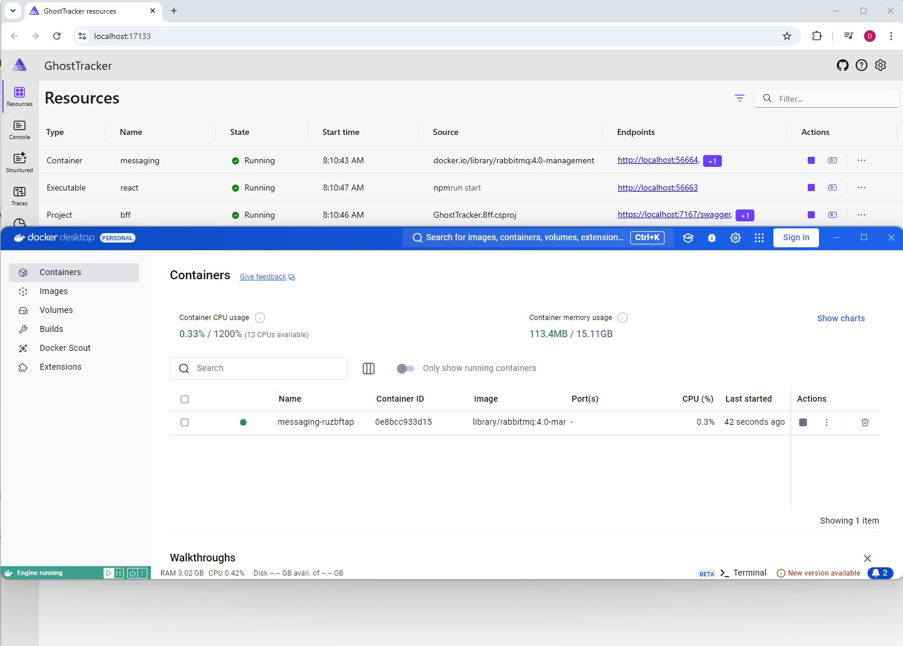

It is also possible to keep the container alive for a faster startup of your application:

```
var rabbitmq = builder.AddRabbitMQ("messaging")
    .WithManagementPlugin()
    .WithLifetime(ContainerLifetime.Persistent);
```

Now that we have a rabbitMQ instance running, let's setup our trasmitter. Start by adding a trasmitter to our AppHost and referencing RabbitMQ.

```
builder.AddProject<Projects.GhostTracker_Transmitter_RabbitMQ>("ghosttracker-transmitter-rabbitmq")
    .WithReference(rabbitmq);
```

After this go to the `GhostTracker.Transmitter.RabbitMQ` project. First we need to add a package to connect to RabbitMQ. For this we are going to use the `Aspire.RabbitMQ.Client`. This is a low level RabbitMQ Client that is already configured with health checks, logging and telemetry.

After this is done, you can setup rabbitMQ in the `program.cs`:

```
builder.AddRabbitMQClient(connectionName: "messaging");
```

Here we don't need to concern ourselves again with the connectionstring to RabbitMQ. Our Service Discovery package will supply it from our configuration. We just need to make sure the name used is the same as used in the AppHost project.

The same needs to be done for the GhostManager and PathFinder project. Add the code to register the RabbitMQ client and make sure to reference rabbitMQ for both projects in your AppHost.

In these projects we also need to register our listeners with the following registration:

```
builder.Services.AddHostedService<RabbitMqListener>();
```

Once this is done the transmitter should be running smoothly and the extra ghosts should be showing up.

Check the management dashboard of RabbitMQ to see your events. You can find the login details in the service details on the dashboard.


## Step 7 - Getting to the cloud

With Aspire it's easy to deploy your application to the cloud.

We'll start by creating a manifest file for our application. Open a terminal and navigate to your AppHost project. Execute the following command:

```
dotnet run --project .\GhostTracker.AppHost.csproj --publisher manifest --output-path .\aspire-manifest.json
```

This command builds your application and will publish a manifest file. Open the file and inspect it.

The manifest JSON consists of a single object called resources which contains all resources described in your AppHost file. This is a gimps behind the curtain of how Aspire is setting up each resource and configuring them. It is possible to use this manifest to integrate Aspire in your own deployment process or use it as a resource for deployment tools.

More info about how this is setup can be found [here](https://learn.microsoft.com/en-us/dotnet/aspire/deployment/manifest-format).

Now that we had a look at our manifest, let's try to deploy our application to Azure.

First make sure you have the [Azure developer cli](https://learn.microsoft.com/en-us/azure/developer/azure-developer-cli/install-azd) installed and are logged in.

Now navigate to the AppHost directory in a terminal and execute the command `azd init`. This command will analyze your project and recognize that it is an Aspire application. Follow the prompts and specify an environment name.

Once this has run successfully you can deploy your app with `azd up`. Select the subscription you'd like to use and the region you'd like to deploy in. This may take some time.

Once this process is finished you can find your running application in container apps on azure together with a Aspire Dashboard with working open telemetry logging.

**Warning: Don't forget to delete your resources after your done.**